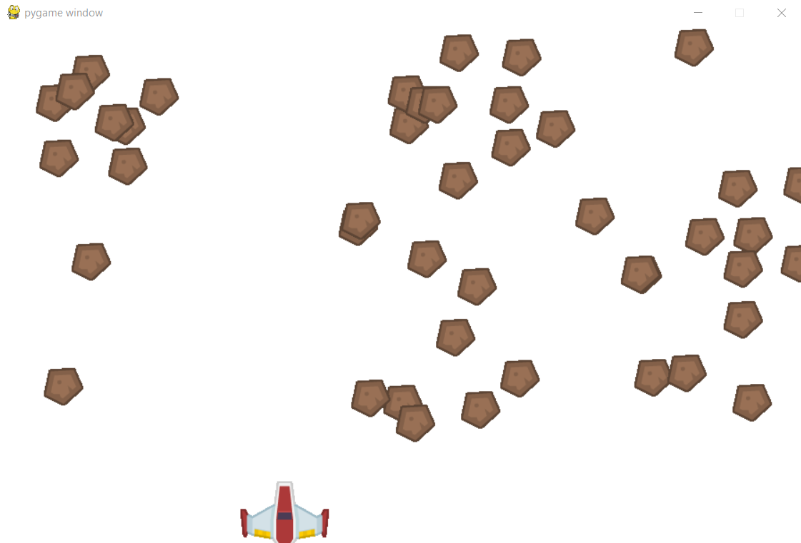
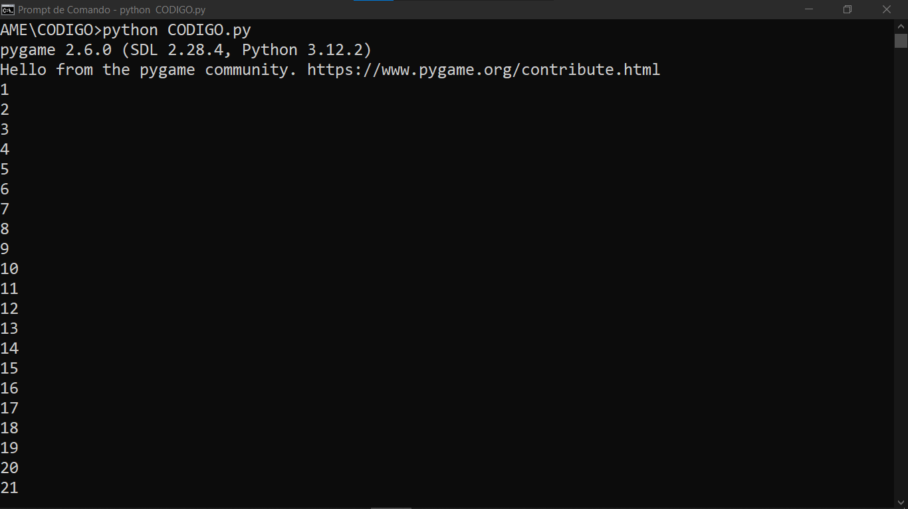

# SHOOTER COM PYGAME
👨‍🏫PROJETO CRIADO PARA O CURSO DE PYGAME.

 <br>
 <br>

## DESCRIÇÃO:
Esse jogo é uma simples "shooter" no estilo arcade onde o jogador controla uma nave que deve destruir meteoros que aparecem na tela.

No jogo, você controla uma nave espacial que deve disparar lasers para destruir meteoros que estão caindo do topo da tela. O objetivo é acertar o maior número possível de meteoros para aumentar sua pontuação.

## COMO FUNCIONA?
- **Nave (Player)**:
  - Controlada pelo jogador com as teclas de seta esquerda e direita.
  - A nave se move horizontalmente e é fixada na parte inferior da tela (y = 510).

- **Meteoros**:
  - São gerados aleatoriamente na parte superior da tela e se movem para baixo. Quando atingidos por um laser, eles desaparecem.

- **Lasers**:
  - São disparados pela nave quando a tecla de espaço é pressionada. Viajam para cima e removem os meteoros ao colidirem com eles.

- **Pontuação**:
  - Cada vez que um meteoro é atingido, o score é incrementado em 1 e exibido no console.

## EXECUTANDO O JOGO:
1. **Instalando as dependências:**
   - Antes de executar o jogo, certifique-se de instalar todas as dependências necessárias. No terminal, execute o seguinte comando para instalar as dependências listadas no arquivo `requirements.txt` em `CODIGO`:
   ```bash
   pip install -r requirements.txt
   ```

2. **Inicie o Jogo:**
   - Inicie com o seguinte comando:
   ```bash
   python CODIGO.py
   ```

3. **Jogando:**
   1. **Movimento da Nave**:
      - **Tecla Esquerda (←)**: Move a nave para a esquerda.
      - **Tecla Direita (→)**: Move a nave para a direita.

   2. **Disparo de Lasers**:
      - **Tecla Espaço (Space)**: Lança um laser da nave. O laser viaja para cima e tenta atingir os meteoros.

   3. **Objetivo**:
      - O objetivo é destruir o máximo possível de meteoros que aparecem na tela. Cada vez que um meteoro é atingido por um laser, ele desaparece e a pontuação aumenta.

## CREDITOS:
- [PROJETO CRIADO PARA O CURSO DE PYGAME](https://github.com/VILHALVA/CURSO-DE-PYGAME)
- [PROJETO FEITO PELO VILHALVA](https://github.com/VILHALVA)


